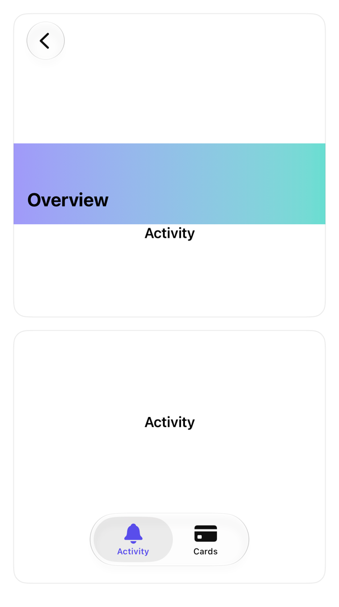

<!-- Generated by `swiftui-registry generate catalog` from Registry metadata. Do not edit by hand; edit the item document and regenerate. -->

# sidebar

Native guidance for a sidebar layout with NavigationSplitView and a selection-bound List on iPad.



More previews: [dark](../images/items/sidebar-dark.png)

Nothing to install. Copy the snippet below

## Usage

```swift
@State private var selection: String? = "activity"

NavigationSplitView {
    List(selection: $selection) {
        Label("Activity", systemImage: "bell").tag("activity")
        Label("Cards", systemImage: "creditcard").tag("cards")
    }
    .navigationTitle("Bank")
} detail: {
    if selection == "activity" { ActivityScreen() } else { CardsScreen() }
}
```

## Why native is enough

Use `NavigationSplitView` with a selection-bound `List` for the sidebar; the system collapses it to a stack on iPhone, adds the column toggle, and handles keyboard and pointer selection. Do not rebuild a sidebar with a manual HStack.

## Details

- Kind: recipe
- Version: 0.1.0
- Platforms: iOS 26.0+
- Accessibility contract:
  - Sidebar rows are native list cells with selection semantics.
  - The column toggle button is system-provided and labeled.
  - Selection state stays caller-owned through the binding.
