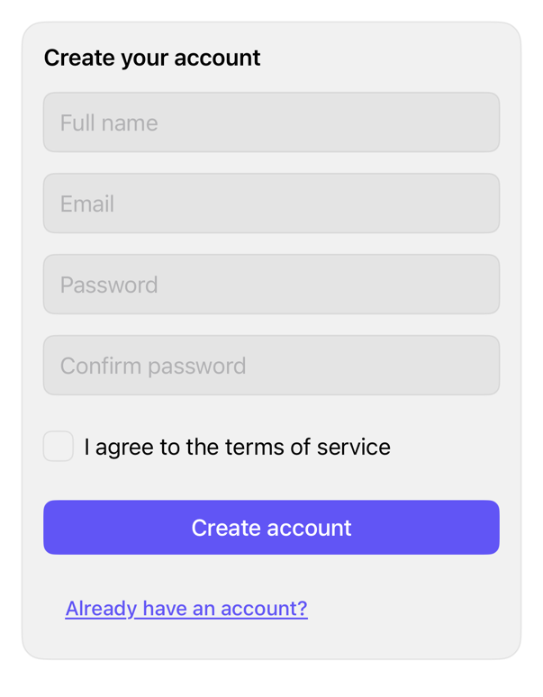

<!-- Generated by `swiftui-registry generate catalog` from Registry metadata. Do not edit by hand; edit the item document and regenerate. -->

# signup-form

Composes registry input, button, card, and checkbox treatments into a sign-up form with caller-owned fields, validation messages, terms acceptance, and submission state.



More previews: [dark](../images/items/signup-form-dark.png)

## Install

```sh
swiftui-registry install signup-form --destination Sources/YourFeature/Components
```

Point `--destination` at a folder inside the consuming target's sources, such as `Sources/YourFeature/Components`, so the copied files are members of that build target

Then add package https://github.com/mangobyte-dev/swiftui-ui-registry.git (from 0.1.0 up to the next minor version) and link product SwiftUIRegistryFoundations

```swift
// Package.swift
dependencies: [
    .package(url: "https://github.com/mangobyte-dev/swiftui-ui-registry.git", .upToNextMinor(from: "0.1.0"))
]

// In the consuming target's dependencies:
.product(name: "SwiftUIRegistryFoundations", package: "swiftui-ui-registry")
```

In an Xcode app project instead, choose File > Add Package Dependency, enter https://github.com/mangobyte-dev/swiftui-ui-registry.git with the same version rule, and add the SwiftUIRegistryFoundations product to your app target

Verify the install by building the consuming target for an iOS Simulator destination

## Usage

```swift
SignUpForm(
    "Create your account",
    name: $name,
    nameError: nameError,
    email: $email,
    emailError: emailError,
    password: $password,
    passwordError: passwordError,
    confirmation: $confirmation,
    confirmationError: confirmationError,
    acceptsTerms: $acceptsTerms,
    termsError: termsError,
    formError: formError,
    isSubmitting: isSubmitting,
    secondaryActionTitle: "Already have an account?",
    onSecondaryAction: { },
    onSubmit: { }
)
```

## Details

- Kind: block
- Version: 0.1.0
- Platforms: iOS 26.0+
- Installs in order: [input](input.md) 0.5.0, [button](button.md) 0.5.1, [card](card.md) 0.2.0, [checkbox](checkbox.md) 0.3.1, [signup-form](signup-form.md) 0.1.0
- Accessibility contract:
  - Each of the four fields carries an explicit accessibilityLabel equal to its visible title. Measured on iOS 27: the label-plus-prompt initializer alone exposes the title as placeholder text only, so a field with typed content would be unnamed without it.
  - Focus order runs name to email to password to confirmation: each field submits with a Next return key that advances focus, and the confirmation field's Go return key submits the form.
  - Invalid fields are never color-alone: the input border width increases, a visible footnote message renders under the field, and the message is attached as the field's accessibility hint; the terms error renders under the checkbox the same way.
  - Autofill content types are fixed: the name field is .name, the email field is .username on an email keyboard, and both password fields are .newPassword so the system offers and reuses a strong password. Autofill is verifiable only manually with a saved credential.
  - Field, terms, and form error messages post an AccessibilityNotification.Announcement when they appear or change; an unchanged message is not re-announced. VoiceOver announcement timing has not been verified on device.
  - The terms toggle uses the checkbox style, which exposes a native Toggle as its accessibility representation and keeps a 44 point minimum row height and does not signal selection by color alone.
  - While isSubmitting is true every control is disabled through the environment, the composed styles apply the shared disabled opacity, and the submit button keeps its title as its accessibility label while showing a progress spinner.
  - The card title carries the header accessibility trait.
- Source: [sources/blocks/SignUpForm.swift](../../Registry/sources/blocks/SignUpForm.swift), with the `Sign Up Form` Xcode preview
