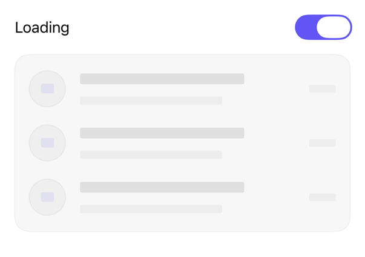

<!-- Generated by Scripts/generate_catalog.py from Registry metadata. Do not edit by hand; edit the item document and regenerate. -->

# skeleton

Turns any view into a loading placeholder with native redaction, disabled interaction, one loading accessibility element, and a pulse that stops under Reduce Motion.



More previews: [dark](../images/items/skeleton-dark.png)

## Install

```sh
python3 Scripts/install.py skeleton --destination Sources/YourFeature/Components
```

Point `--destination` at a folder inside the consuming target's sources, such as `Sources/YourFeature/Components`, so the copied files are members of that build target

Then add package https://github.com/mangobyte-dev/swiftui-ui-registry.git (from 0.1.0 up to the next minor version) and link product SwiftUIRegistryFoundations

```swift
// Package.swift
dependencies: [
    .package(url: "https://github.com/mangobyte-dev/swiftui-ui-registry.git", .upToNextMinor(from: "0.1.0"))
]

// In the consuming target's dependencies:
.product(name: "SwiftUIRegistryFoundations", package: "swiftui-ui-registry")
```

In an Xcode app project instead, choose File > Add Package Dependency, enter https://github.com/mangobyte-dev/swiftui-ui-registry.git with the same version rule, and add the SwiftUIRegistryFoundations product to your app target

Verify the install by building the consuming target for an iOS Simulator destination

## Usage

```swift
@State private var isLoading = true

ActivityRows()
    .registrySkeleton(isLoading)

// Pass false to render the real content unchanged.
```

## Details

- Kind: component
- Version: 0.2.0
- Platforms: iOS 26.0+
- Registry dependencies: none
- Accessibility contract:
  - Placeholder content is disabled and excluded from hit testing, so a placeholder can never trigger a product action.
  - The whole placeholder is one accessibility element with a caller-adjustable loading label instead of exposing meaningless redacted text.
  - The opacity pulse is replaced by a static dimmed state when Reduce Motion is on.
  - Uses native .redacted(reason: .placeholder) and applies every treatment in both states, so the wrapped content keeps its identity, state, and layout when loading starts or ends.
- Source: [sources/components/RegistrySkeletonModifier.swift](../../Registry/sources/components/RegistrySkeletonModifier.swift), with the `Skeleton` Xcode preview
