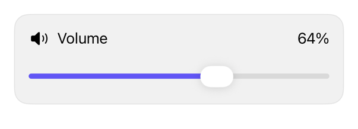

<!-- Generated by `swiftui-registry generate catalog` from Registry metadata. Do not edit by hand; edit the item document and regenerate. -->

# slider

Native guidance for a Slider with semantic tint, control sizing, and caller-owned value and labels.



More previews: [dark](../images/items/slider-dark.png)

Nothing to install. Copy the snippet below

## Usage

```swift
@State private var volume = 64.0

Slider(value: $volume, in: 0...100, step: 1) {
    Text("Volume")
} minimumValueLabel: {
    Image(systemName: "speaker.fill")
        .accessibilityHidden(true)
} maximumValueLabel: {
    Image(systemName: "speaker.wave.3.fill")
        .accessibilityHidden(true)
}
.controlSize(.large)
```

## Why native is enough

Use the native `Slider` and apply `.tint(_:)` and `.controlSize(_:)` directly where the design needs them. The registry adds no wrapper, because those modifiers only forward environment values that the native control already respects.

## Details

- Kind: recipe
- Version: 0.3.0
- Platforms: iOS 26.0+
- Accessibility contract:
  - Retains native Slider adjustable-control semantics and gestures.
  - Keeps the value, bounds, step, and editing callbacks caller-owned.
  - Requires a meaningful label and supports native minimum and maximum labels.
  - Inherits control size, enabled state, and layout direction unless explicitly overridden.
