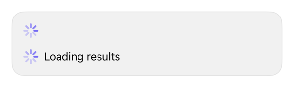

<!-- Generated by `swiftui-registry generate catalog` from Registry metadata. Do not edit by hand; edit the item document and regenerate. -->

# spinner

Styles a native indeterminate ProgressView with a compact circular indicator and optional label.



More previews: [dark](../images/items/spinner-dark.png)

## Install

```sh
swiftui-registry install spinner --destination Sources/YourFeature/Components
```

Point `--destination` at a folder inside the consuming target's sources, such as `Sources/YourFeature/Components`, so the copied files are members of that build target

Then add package https://github.com/mangobyte-dev/swiftui-ui-registry.git (from 0.2.1 up to the next minor version) and link product SwiftUIRegistryFoundations

```swift
// Package.swift
dependencies: [
    .package(url: "https://github.com/mangobyte-dev/swiftui-ui-registry.git", .upToNextMinor(from: "0.2.1"))
]

// In the consuming target's dependencies:
.product(name: "SwiftUIRegistryFoundations", package: "swiftui-ui-registry")
```

In an Xcode app project instead, choose File > Add Package Dependency, enter https://github.com/mangobyte-dev/swiftui-ui-registry.git with the same version rule, and add the SwiftUIRegistryFoundations product to your app target

Verify the install by building the consuming target for an iOS Simulator destination

## Usage

```swift
ProgressView("Loading results")
    .progressViewStyle(.registrySpinner)
```

## Details

- Kind: component
- Version: 0.2.1
- Platforms: iOS 26.0+
- Registry dependencies: none
- Accessibility contract:
  - Retains native indeterminate ProgressView semantics.
  - Requires an accessibility label when no visible loading label is supplied.
  - Combines a visible label with the indicator in reading order.
  - Inherits Dynamic Type, tint, enabled state, and layout direction.
- Source: [sources/components/RegistrySpinnerStyle.swift](../../Registry/sources/components/RegistrySpinnerStyle.swift), with the `Spinner` Xcode preview
