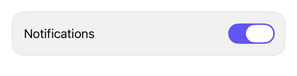

<!-- Generated by Scripts/generate_catalog.py from Registry metadata. Do not edit by hand; edit the item document and regenerate. -->

# switch

Native guidance for applying the platform switch treatment to a Toggle while inheriting app tint and environment behavior.



More previews: [dark](../images/items/switch-dark.png)

Nothing to install. Copy the snippet below

## Usage

```swift
@State private var notifications = true

Toggle("Notifications", isOn: $notifications)
    .toggleStyle(.switch)
```

## Why native is enough

Apply `.toggleStyle(.switch)` directly to a native `Toggle`. The registry adds no wrapper because the one-line native style is the entire treatment.

## Details

- Kind: recipe
- Version: 0.3.0
- Platforms: iOS 26.0+
- Accessibility contract:
  - Retains native Toggle switch semantics and state announcements.
  - Requires a caller-supplied visible label unless the surrounding context supplies an accessibility label.
  - Inherits tint, enabled state, Dynamic Type, and layout direction.
  - Does not replace platform interaction or animation behavior.
