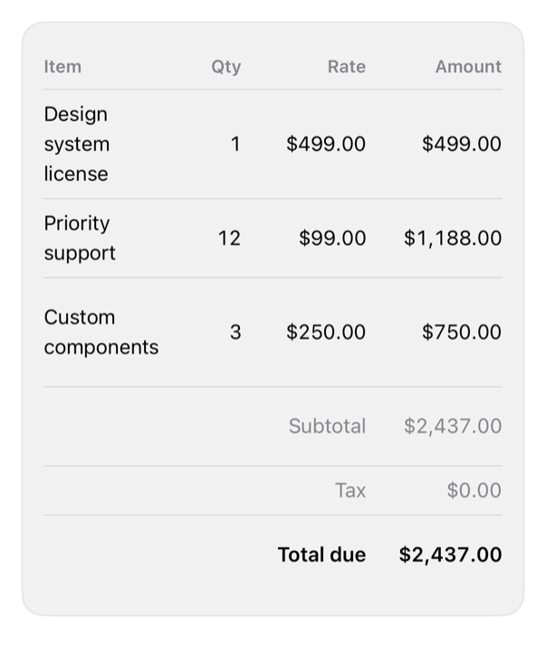

<!-- Generated by `swiftui-registry generate catalog` from Registry metadata. Do not edit by hand; edit the item document and regenerate. -->

# table

Lays out Identifiable rows in aligned columns on a native Grid, with numeric columns in monospaced digits, optional summary rows, and theme hairline separators.



More previews: [dark](../images/items/table-dark.png)

## Install

```sh
swiftui-registry install table --destination Sources/YourFeature/Components
```

Point `--destination` at a folder inside the consuming target's sources, such as `Sources/YourFeature/Components`, so the copied files are members of that build target

Then add package https://github.com/mangobyte-dev/swiftui-ui-registry.git (from 0.1.0 up to the next minor version) and link product SwiftUIRegistryFoundations

```swift
// Package.swift
dependencies: [
    .package(url: "https://github.com/mangobyte-dev/swiftui-ui-registry.git", .upToNextMinor(from: "0.1.0"))
]

// In the consuming target's dependencies:
.product(name: "SwiftUIRegistryFoundations", package: "swiftui-ui-registry")
```

In an Xcode app project instead, choose File > Add Package Dependency, enter https://github.com/mangobyte-dev/swiftui-ui-registry.git with the same version rule, and add the SwiftUIRegistryFoundations product to your app target

Verify the install by building the consuming target for an iOS Simulator destination

## Usage

```swift
DataTable(
    lines,
    columns: [
        DataTableColumn(Text("Item")) { Text($0.item) },
        DataTableColumn(Text("Qty"), alignment: .trailing) { Text($0.quantity, format: .number) },
        DataTableColumn(Text("Amount"), alignment: .trailing) { Text($0.amount, format: .currency(code: "USD")) }
    ],
    footer: [
        DataTableFooterRow(label: Text("Total due"), value: Text(total, format: .currency(code: "USD")), isEmphasized: true)
    ]
)
```

## Details

- Kind: component
- Version: 0.1.0
- Platforms: iOS 26.0+
- Installs in order: [separator](separator.md) 0.2.0, [table](table.md) 0.1.0
- Accessibility contract:
  - Each header and body row is combined into one accessibility element so VoiceOver reads its cells in order; the header row also carries the header trait.
  - Trailing columns are the numeric convention: their cells use monospaced digits and hug the trailing edge, so figures line up down the column.
  - Built on a native Grid rather than SwiftUI Table, which collapses to a single column on iPhone; the leading column takes the remaining width so the table fills its container.
  - Uses system text styles and the semantic spacing tokens, and the theme border for hairline separators; cell content wraps rather than truncates.
- Source: [sources/components/DataTable.swift](../../Registry/sources/components/DataTable.swift), with the `Data Table` Xcode preview
