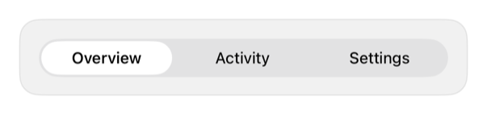

<!-- Generated by `swiftui-registry generate catalog` from Registry metadata. Do not edit by hand; edit the item document and regenerate. -->

# tabs

Picker segmented; local selection, TabView nav.



More previews: [dark](../images/items/tabs-dark.png)

Nothing to install. Copy the snippet below

## Usage

```swift
@State private var selection = "overview"

Picker("Section", selection: $selection) {
    Text("Overview").tag("overview")
    Text("Activity").tag("activity")
    Text("Settings").tag("settings")
}
.pickerStyle(.segmented)
```

## Why native is enough

`.pickerStyle(.segmented)`: local selection; `TabView`: app nav. No wrapper.

## Details

- Kind: recipe
- Version: 0.3.0
- Platforms: iOS 26.0+
- Accessibility contract:
  - Retains Picker segmented semantics; selection caller-owned, not TabView nav.
  - Needs concise, large-text-legible segment labels; inherits enabled, tint, direction.
