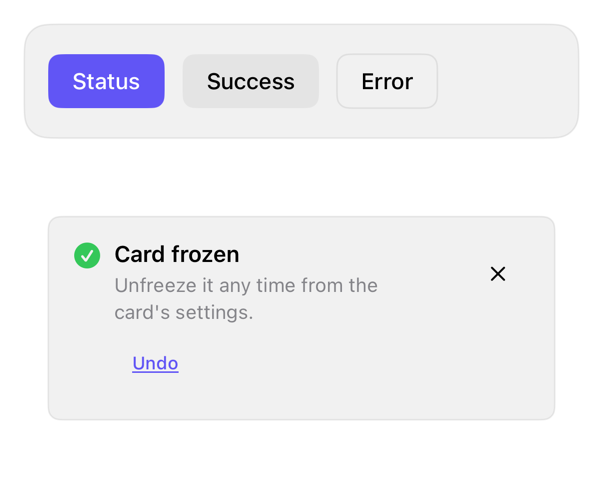

<!-- Generated by `swiftui-registry generate catalog` from Registry metadata. Do not edit by hand; edit the item document and regenerate. -->

# toast

Presents a transient status toast over content with informational, positive, and destructive variants, an optional caller-run action, and swipe, tap, or timed dismissal.



More previews: [dark](../images/items/toast-dark.png)

## Install

```sh
swiftui-registry install toast --destination Sources/YourFeature/Components
```

Point `--destination` at a folder inside the consuming target's sources, such as `Sources/YourFeature/Components`, so the copied files are members of that build target

Then add package https://github.com/mangobyte-dev/swiftui-ui-registry.git (from 0.3.0 up to the next minor version) and link product SwiftUIRegistryFoundations

```swift
// Package.swift
dependencies: [
    .package(url: "https://github.com/mangobyte-dev/swiftui-ui-registry.git", .upToNextMinor(from: "0.3.0"))
]

// In the consuming target's dependencies:
.product(name: "SwiftUIRegistryFoundations", package: "swiftui-ui-registry")
```

In an Xcode app project instead, choose File > Add Package Dependency, enter https://github.com/mangobyte-dev/swiftui-ui-registry.git with the same version rule, and add the SwiftUIRegistryFoundations product to your app target

Verify the install by building the consuming target for an iOS Simulator destination

## Usage

```swift
@State private var toast: RegistryToast?

CardDetail()
    .registryToast($toast)

// Present a destructive toast with an undo action:
toast = RegistryToast(
    title: "Message deleted",
    variant: .destructive,
    action: RegistryToast.Action(label: "Undo") { restoreMessage() }
)
```

## Details

- Kind: component
- Version: 0.1.1
- Platforms: iOS 26.0+
- Installs in order: [button](button.md) 0.5.2, [toast](toast.md) 0.1.1
- Accessibility contract:
  - Each variant pairs its own symbol with its color, so informational, positive, and destructive meaning never rests on color alone.
  - When a toast appears it posts a VoiceOver announcement built from the title and message, so the update is spoken without moving focus away from the current task.
  - The title and message combine into one accessibility element, while the optional action button and the close control stay separate, activatable elements.
  - The close control carries a Dismiss label and the leading symbol is hidden from VoiceOver, so the tone reaches assistive technology through the title and message text.
  - Under Reduce Motion the enter and exit collapse to a fade with no slide, and the title scales down before it wraps while the message wraps to at most two lines.
- Source: [sources/components/RegistryToastModifier.swift](../../Registry/sources/components/RegistryToastModifier.swift), with the `Toast` Xcode preview
