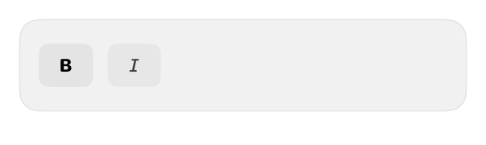

<!-- Generated by `swiftui-registry generate catalog` from Registry metadata. Do not edit by hand; edit the item document and regenerate. -->

# toggle

Applies registry button treatments to native Toggle state for compact selectable controls.



More previews: [dark](../images/items/toggle-dark.png)

## Install

```sh
swiftui-registry install toggle --destination Sources/YourFeature/Components
```

Point `--destination` at a folder inside the consuming target's sources, such as `Sources/YourFeature/Components`, so the copied files are members of that build target

Then add package https://github.com/mangobyte-dev/swiftui-ui-registry.git (from 0.1.0 up to the next minor version) and link product SwiftUIRegistryFoundations

```swift
// Package.swift
dependencies: [
    .package(url: "https://github.com/mangobyte-dev/swiftui-ui-registry.git", .upToNextMinor(from: "0.1.0"))
]

// In the consuming target's dependencies:
.product(name: "SwiftUIRegistryFoundations", package: "swiftui-ui-registry")
```

In an Xcode app project instead, choose File > Add Package Dependency, enter https://github.com/mangobyte-dev/swiftui-ui-registry.git with the same version rule, and add the SwiftUIRegistryFoundations product to your app target

Verify the install by building the consuming target for an iOS Simulator destination

## Usage

```swift
// Content layer only. In toolbars, tab bars, or floating chrome the system supplies Liquid Glass; use .buttonStyle(.glass) or .buttonStyle(.glassProminent) there instead of .registry styles.

@State private var bold = false

Toggle("Bold", systemImage: "bold", isOn: $bold)
    .toggleStyle(.registryToggle)
```

## Details

- Kind: component
- Version: 0.2.0
- Platforms: iOS 26.0+
- Installs in order: [button](button.md) 0.5.0, [toggle](toggle.md) 0.2.0
- Accessibility contract:
  - Retains native Toggle state and activation behavior.
  - Requires caller-supplied labels for icon-only controls.
  - Uses opacity and native selected state in addition to color.
  - Inherits Dynamic Type, enabled state, control size, and layout direction.
- Source: [sources/components/RegistryToggleStyle.swift](../../Registry/sources/components/RegistryToggleStyle.swift), with the `Toggle` Xcode preview
