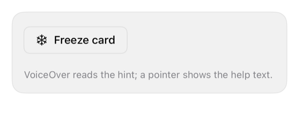

<!-- Generated by `swiftui-registry generate catalog` from Registry metadata. Do not edit by hand; edit the item document and regenerate. -->

# tooltip

Tooltip: hint, popover.



More previews: [dark](../images/items/tooltip-dark.png)

Nothing to install. Copy the snippet below

## Usage

```swift
Button("Freeze card", systemImage: "snowflake") { }
    .buttonStyle(.registryOutline)
    .accessibilityHint("Blocks new purchases until you unfreeze the card.")
    .help("Blocks new purchases until you unfreeze the card.")
```

## Why native is enough

No iPhone hover; `accessibilityHint` (VoiceOver) + `.help` (pointer/iPad) = tooltip. Sighted-info also needs copy/popover.

## Details

- Kind: recipe
- Version: 0.1.0
- Platforms: iOS 26.0+
- Accessibility contract:
  - Hint after label; help: pointer/iPad/macOS-style hover.
  - MUST NOT rely on hover-only info, touch.
