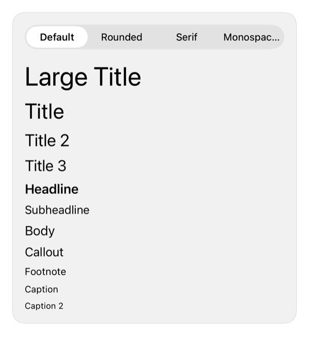

<!-- Generated by `swiftui-registry generate catalog` from Registry metadata. Do not edit by hand; edit the item document and regenerate. -->

# typography

Native guidance for Apple's eleven text styles as the type scale with weight, design, and monospaced digits.



More previews: [dark](../images/items/typography-dark.png)

Nothing to install. Copy the snippet below

## Usage

```swift
VStack(alignment: .leading, spacing: 8) {
    Text("Balance")
        .font(.title2.weight(.semibold))
    Text(amount, format: .currency(code: "KWD"))
        .font(.largeTitle)
        .monospacedDigit()
    Text("Updated today")
        .font(.footnote)
        .foregroundStyle(.secondary)
}
.fontDesign(.rounded)
```

## Why native is enough

Apple's eleven text styles from `.largeTitle` to `.caption2` are the type scale, and they scale with Dynamic Type. Regular through Bold is the legible weight range. One `.fontDesign` change at the root sets the whole typographic voice. Use `.monospacedDigit()` where figures must align, such as currency. Watch weights below Regular: they thin out and fail legibility at small sizes.

## Details

- Kind: recipe
- Version: 0.1.0
- Platforms: iOS 26.0+
- Accessibility contract:
  - Text styles scale with Dynamic Type, including the accessibility sizes, without hardcoded point sizes.
  - Keep weights in the Regular through Bold range so text stays legible at small sizes.
