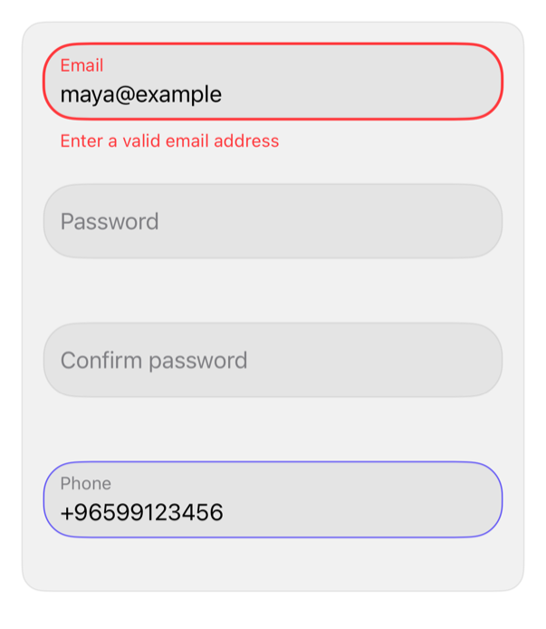

<!-- Generated by `swiftui-registry generate catalog` from Registry metadata. Do not edit by hand; edit the item document and regenerate. -->

# validated-input

Text field with floating label, rounded border by focus and validity, rules checked while typing and on blur.



More previews: [dark](../images/items/validated-input-dark.png)

## Install

```sh
swiftui-registry install validated-input --destination Sources/YourFeature/Components
```

Point `--destination` at a folder inside the consuming target's sources, such as `Sources/YourFeature/Components`, so the copied files are members of that build target

Then add package https://github.com/mangobyte-dev/swiftui-ui-registry.git (from 0.3.0 up to the next minor version) and link product SwiftUIRegistryFoundations

```swift
// Package.swift
dependencies: [
    .package(url: "https://github.com/mangobyte-dev/swiftui-ui-registry.git", .upToNextMinor(from: "0.3.0"))
]

// In the consuming target's dependencies:
.product(name: "SwiftUIRegistryFoundations", package: "swiftui-ui-registry")
```

In an Xcode app project instead, choose File > Add Package Dependency, enter https://github.com/mangobyte-dev/swiftui-ui-registry.git with the same version rule, and add the SwiftUIRegistryFoundations product to your app target

Verify the install by building the consuming target for an iOS Simulator destination

## Usage

```swift
@State private var email = ""
@State private var password = ""
@State private var confirmation = ""
@State private var phone = ""
@State private var emailValidity: InputValidity = .empty

ValidatedInput("Email", text: $email, validations: [.required, .email], validity: $emailValidity)
    .keyboardType(.emailAddress)
    .textInputAutocapitalization(.never)

ValidatedInput("Password", text: $password, validations: [.required, .password()], isSecure: true)

ValidatedInput("Confirm password", text: $confirmation, validations: [.required, .matching(password)], isSecure: true)

ValidatedInput("Phone", text: $phone, validations: [.required, .internationalPhone])
    .keyboardType(.phonePad)
```

## Details

- Kind: component
- Version: 0.1.0
- Platforms: iOS 26.0+
- Registry dependencies: none
- Accessibility contract:
  - Label is the field's accessibilityLabel; the floating label is hidden from VoiceOver.
  - Error becomes the hint and is announced when it appears.
  - Focus and error change the border; error pairs color with the message text, never color alone.
  - The label rises inside the field and a field with rules reserves its message line, so focus and errors never move neighboring views.
  - Grows with Dynamic Type; no fixed heights; Reduce Motion drops the label animation.
  - Inherits layout direction and tint; disabled state dims to the theme's disabledOpacity.
- Source: [sources/components/ValidatedInput.swift](../../Registry/sources/components/ValidatedInput.swift), with the `Validated Input` Xcode preview
